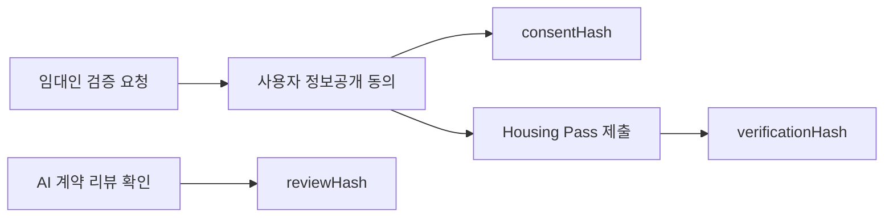
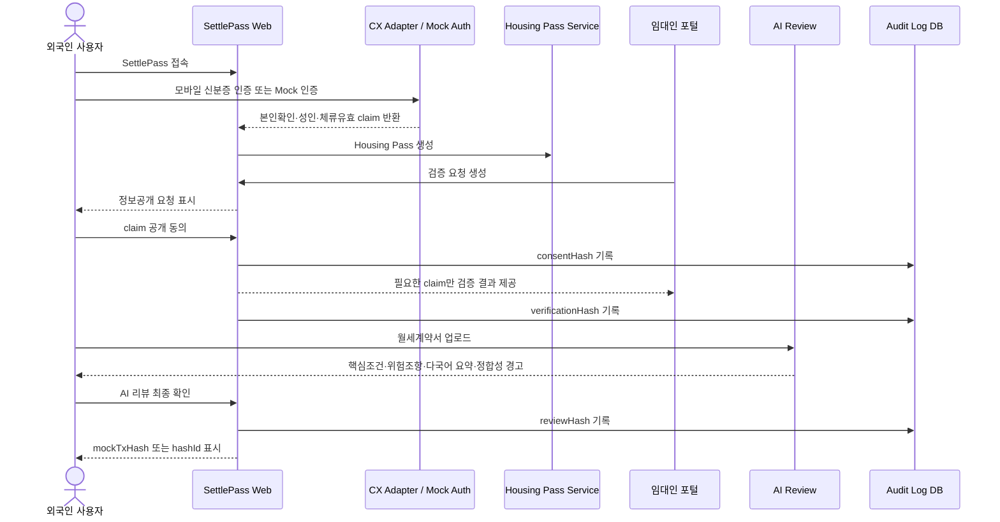

# SettlePass 1차 MVP 최종 기획서 v5.1

> 본 문서는 제출용 제안서가 아니다.  
> 팀원이 SettlePass의 문제정의, 제품 목적, 구현 범위, 기술 우선순위, 예선 전 MVP 완성 기준을 동일하게 이해하기 위한 내부 기획 문서다.

---

## 0. 문서 목적

이 문서는 1차 MVP에서 무엇을 만들고, 무엇을 만들지 않으며, 왜 그 범위로 제한하는지 팀 내부 합의를 고정하기 위한 문서다.

1차 MVP는 **주거 도메인에만 집중한 웹앱 데모**다. 외국인 정주의 모든 문제를 해결하지 않는다. 대신 가장 구체적이고 시연 가능한 상황인 **외국인의 월세·주거계약 과정**에서 다음 흐름을 검증한다.

1. 외국인 사용자가 모바일 신분증 기반 인증 플로우를 통과한다.
2. 주거계약 목적의 `Housing Pass`를 생성한다.
3. 임대인은 월세계약에 필요한 최소 claim만 요청한다.
4. 사용자는 요청된 claim을 확인하고 선택적으로 공개한다.
5. AI는 월세계약서의 핵심조건, 위험조항, 체류기간-계약기간 정합성을 분석한다.
6. 사용자는 AI 계약 리뷰를 확인하고 최종 확인한다.
7. 시스템은 사용자의 동의·검증·리뷰 확인 이력을 해시로 남긴다.

1차 MVP는 **Sui를 통합하지 않는다.**  
Sui, Walrus, PTB, zkLogin은 결선 진출 이후 2차 MVP에서 통합한다.

1차 MVP는 **모바일 외국인등록증 실연동을 전제로 하지 않는다.**  
다만 단순 Mock만 사용하는 것이 아니라, 가능하면 **OmniOne CX 인증 파이프라인은 팀 보유 한국 모바일 신분증으로 실연동 검증**하고, 외국인등록증 고유 claim인 체류자격·체류만료일·체류지역은 Mock Data로 고정한다.

이 전략은 기술 시연 신뢰도와 개발 리스크를 동시에 관리하기 위한 것이다.

---

## 1. 프로젝트 개요

## 1.1 프로젝트명

**SettlePass**

## 1.2 팀명

**이리온**

## 1.3 서비스 정의

SettlePass는 국내 체류 외국인이 한국에서 정주할 때 반복적으로 요구받는 신원·체류·계약 관련 정보를 안전하게 관리하고, 필요한 자격만 선택적으로 공개할 수 있도록 돕는 **외국인 정주 신뢰 인프라**다.

단순한 “외국인 신분증 로그인 서비스”가 아니다. SettlePass가 해결하려는 문제는 로그인 이후의 문제다.

외국인은 한국에서 주거, 금융, 통신, 고용, 교육, 행정서비스에 접근할 때 본인확인뿐 아니라 다음을 계속 증명해야 한다.

- 현재 한국에 합법적으로 체류 중인가
- 체류기간이 계약기간 또는 서비스 이용기간과 충돌하지 않는가
- 성인 여부를 확인할 수 있는가
- 어느 지역에 거주하거나 거주할 예정인가
- 어떤 문서를 제출했고 어떤 정보공개에 동의했는가
- 계약서 핵심내용과 위험조항을 이해했는가

1차 MVP는 이 중 **주거계약**에 집중한다.

## 1.4 1차 MVP 한 줄 정의

> 1차 MVP는 외국인 사용자가 모바일 신분증 인증 파이프라인 또는 Mock 외국인등록증 인증으로 본인확인을 완료하고, Housing Pass를 생성해 임대인에게 필요한 claim만 선택 공개하며, AI 월세계약 리뷰를 확인한 이력을 reviewHash로 기록하는 웹앱 데모다.

## 1.5 1차 MVP의 핵심 메시지

```text
SettlePass는 부동산 공증 서비스가 아니다.
SettlePass는 외국인이 한국 정주 과정에서 겪는 신원·체류·계약 이해 불편을 줄이는 서비스다.
```

따라서 1차 MVP의 핵심 기록 대상은 계약서 원본의 `documentHash`가 아니다.  
사용자가 AI 계약 분석을 확인했다는 `reviewHash`가 핵심이다.

---

# 2. 문제정의

## 2.1 핵심 문제

외국인의 한국 정착은 단순한 “신원 확인” 문제가 아니다. 정착 과정에서는 다음 세 가지 신뢰가 동시에 요구된다.

| 신뢰 유형 | 질문 | 기존 방식의 문제 |
|---|---|---|
| 신원 신뢰 | 이 사람이 실제 본인인가 | 신분증 사본·여권 사진 제출에 의존 |
| 체류 신뢰 | 현재 체류가 유효한가 | 체류기간·체류자격을 임대인·기관이 직접 판단하기 어려움 |
| 계약 신뢰 | 계약 내용을 이해했는가 | 한국어 계약서 이해를 외국인 개인 역량에 맡김 |

기존 방식에서는 외국인이 신분증 사본, 여권 사진, 재학증명서, 고용서류 등을 반복 제출하고, 임대인이나 기관은 그 서류의 진위·최신성·충분성을 직접 판단해야 한다.

SettlePass는 이 문제를 다음 구조로 줄인다.

```text
모바일 신분증 기반 원천 본인확인
→ Housing Pass 생성
→ 필요한 claim만 선택 공개
→ AI 계약 리뷰
→ 동의·검증·리뷰 확인 이력 기록
```

## 2.2 외국인 사용자 Pain

| 구분 | 문제 | 1차 MVP에서의 대응 |
|---|---|---|
| 서류 반복 제출 | 외국인등록증, 여권, 재학증명서, 고용확인서 등을 여러 곳에 반복 제출 | Housing Pass로 필요한 claim만 제출 |
| 개인정보 노출 | 신분증 사본·여권 사진을 메신저나 이메일로 보내는 과정에서 유출 불안 | 등록번호·국적·상세주소 비공개 |
| 언어 장벽 | 월세계약서, 관리비, 특약, 중도해지 조건을 이해하기 어려움 | AI 계약 리뷰와 다국어 요약 |
| 정보 비대칭 | 임대인이 요구하는 서류가 정당한지 판단하기 어려움 | 요청 claim과 비공개 claim을 UI에 명시 |
| 계약 불안 | 계약기간, 보증금, 관리비, 위약금, 수리 책임을 충분히 이해하지 못한 채 서명 | 핵심조건·위험조항 구조화 |
| 정착 지연 | 집 계약 지연이 통신·금융·학교·회사 등록 지연으로 연결 | 주거계약 온보딩 흐름 단축 |

## 2.3 임대인·기관 Pain

| 구분 | 문제 | 1차 MVP에서의 대응 |
|---|---|---|
| 신원 확인 부담 | 외국인등록증·여권 등을 직접 확인해야 함 | `identityVerified` claim 제공 |
| 성인 여부 확인 | 생년월일 전체를 보지 않고 성인 여부만 알고 싶음 | `ageOver19` claim 제공 |
| 체류 유효성 확인 | 계약기간 중 체류기간이 만료되는지 판단하기 어려움 | `residenceValid`, `residenceExpiryMonth` 제공 |
| 언어 장벽 | 계약 내용을 충분히 설명했는지 확신하기 어려움 | AI 리뷰 확인 이력 제공 |
| 사후 증빙 부족 | 정보공개 동의와 검증 이력을 남기기 어려움 | `consentHash`, `verificationHash`, `reviewHash` 기록 |

## 2.4 사회적 Pain

| 구분 | 문제 |
|---|---|
| 외국인 거래 회피 | 신뢰 확인 비용이 높아 외국인 임차인을 기피할 수 있음 |
| 개인정보 사본 유통 | 신분증 사본이 여러 기관·개인에게 분산 유통됨 |
| 정주 초기 진입장벽 | 주거가 불안정하면 금융·통신·고용·교육 접근도 지연됨 |
| 지원 인프라 분산 | 외국인 지원 정보가 대학, 지자체, 커뮤니티, 민간 플랫폼에 흩어져 있음 |

## 2.5 기술적 기회

| 기술적 변화 | SettlePass 기회 |
|---|---|
| 모바일 외국인등록증 발급 시작 | 외국인 신원·체류 claim을 디지털로 활용 가능 |
| 모바일 신분증/DID 인프라 | 사본 제출 없이 필요한 속성만 검증 가능 |
| OpenDID/VC/VP 모델 | 정주 목적별 Pass 모델링 가능 |
| 블록체인 감사 로그 | 동의·검증·리뷰 확인 이력의 위변조 방지 가능 |
| AI | 계약서 이해·다국어 요약·체류기간 정합성 점검 가능 |

---

# 3. 1차 MVP 범위

## 3.1 범위 고정 원칙

1차 MVP는 **주거계약 플로우만 구현**한다.

범위를 좁히는 이유는 다음과 같다.

1. 2인 대학생 팀 기준으로 예선 전까지 완성 가능한 범위가 필요하다.
2. 주거계약은 외국인 정주 초기에 가장 직접적인 페인포인트다.
3. 월세계약서는 AI 분석 시연에 적합하다.
4. 임대인 검증 요청은 선택적 정보공개 구조를 명확히 보여준다.
5. 신원·체류·계약 이해를 하나의 데모 플로우로 묶을 수 있다.

## 3.2 포함 범위

| 영역 | 포함 기능 | 구현 방식 |
|---|---|---|
| 사용자 인증 | 모바일 신분증 인증 파이프라인 또는 Mock 외국인등록증 인증 | `CX_REAL_MODE` + `CX_MOCK_MODE` |
| 패스 생성 | Housing Pass 생성 | OpenDID VC/VP 데이터 모델 기반 JSON |
| 선택적 정보공개 | 임대인 요청에 대한 claim 단위 동의·거절 | 웹 UI |
| 기관 검증 | 임대인 검증 요청 생성 및 결과 확인 | Verifier Portal |
| AI 계약 리뷰 | 월세계약서 핵심조건 추출, 위험조항 요약, 다국어 요약 | AI Review Module |
| 정합성 점검 | 체류만료월과 계약종료일 충돌 여부 경고 | Rule + AI |
| 이력 기록 | consentHash, verificationHash, reviewHash | DB + mockTxHash |
| 데모 UI | 사용자 웹앱 + 임대인 포털 | Next.js Web App |

## 3.3 제외 범위

| 제외 항목 | 제외 이유 | 2차 MVP 계획 |
|---|---|---|
| Sui 통합 | 1차 목표는 SettlePass 기본 플로우 검증 | 2차에서 Move, Walrus, PTB, zkLogin 통합 |
| 모바일앱 | 1차는 웹앱 데모 완성도 우선 | 2차에서 모바일앱 확장 |
| 외국인등록증 실연동 | 테스트 credential 확보 불확실 | 2차에서 실연동 + Mock fallback |
| OpenDID 실발급 | 1차는 데이터 모델과 UX 검증 우선 | 2차에서 Issuer/Verifier 연동 |
| OmniOne Chain 온체인 기록 | 예선 전 권한·환경 불확실 | 2차에서 실제 txHash 기록 |
| Work Pass | 도메인 확장으로 범위 증가 | 2차에서 근로계약 분석과 함께 확장 |
| Finance/Telecom Pass | 기관 연동·정책 검토 필요 | 2차 이후 온보딩 API로 확장 |
| 계약서 원본 공증 | SettlePass 목적과 다름 | 계속 제외 |
| documentHash 중심 기록 | 부동산 공증 서비스로 오해될 수 있음 | reviewHash 유지 |
| 실제 전자계약 체결 | 법적·운영 리스크 큼 | 당분간 제외 |
| 실제 법률 자문 | AI 오판 책임 리스크 | 계약 이해 보조로 제한 |

## 3.4 예선/결선/2차 MVP 구분

| 구분 | 목표 | 구현 수준 |
|---|---|---|
| 1차 MVP | 주거 도메인에서 SettlePass 핵심 플로우 시연 | 웹앱, Mock claim, DB hash, mockTxHash |
| 결선 대응 | 기술 완성도 강화 | 외국인등록증 실연동, OpenDID VC/VP, OmniOne Chain txHash |
| 2차 MVP | 다도메인 + Sui 통합 | 모바일앱, Work/Finance/Telecom, Sui Proof Layer |

---

# 4. 인증 전략

## 4.1 핵심 원칙

1차 MVP의 신분증 전략은 단순 Mock이 아니다.  
팀이 실제로 보여줄 수 있는 부분과 Mock으로 처리해야 하는 부분을 분리한다.

```text
실연동 가능한 부분:
OmniOne CX 모바일 신분증 인증 파이프라인

Mock 처리할 부분:
외국인등록증 고유 claim
- 체류자격
- 체류만료일
- 체류지역
- 등록외국인 여부
```

## 4.2 왜 한국 모바일 신분증 실연동 + 외국인 claim Mock인가

외국인등록증 테스트 credential이 제공되지 않으면 실제 외국인등록증 인증을 예선 전에 구현하기 어렵다. 그러나 모바일 신분증 인증 파이프라인 자체는 한국 모바일 신분증으로 검증할 수 있다.

이 전략의 장점은 다음이다.

| 장점 | 설명 |
|---|---|
| 기술 시연 신뢰도 확보 | 단순 Mock이 아니라 실제 CX 흐름을 일부 검증 가능 |
| 외국인 도메인 유지 | 체류자격·체류만료 등 외국인 claim은 Mock으로 유지 |
| 2차 확장 용이 | 동일 Adapter 인터페이스에 외국인등록증 실연동만 교체 가능 |
| 발표 방어 가능 | “실연동 불가”가 아니라 “공통 파이프라인 검증 + 외국인 claim Mock”으로 설명 가능 |

## 4.3 인증 모드

| 모드 | 설명 | 사용 시점 |
|---|---|---|
| `CX_REAL_MODE` | OmniOne CX 실제 API를 통해 모바일 신분증 인증 | 기술 테스트, 가능 시 데모 |
| `CX_MOCK_MODE` | OmniOne CX 응답 구조를 모사한 Mock claim 생성 | 데모 안정성 확보 |
| `FOREIGNER_CLAIM_MOCK` | 외국인등록증 고유 claim을 Mock Data로 주입 | 1차 MVP 기본 |

## 4.4 1차 MVP 인증 결과 예시

```json
{
  "identityVerified": true,
  "credentialType": "MOBILE_FOREIGNER_ID_MOCK",
  "ageOver19": true,
  "residenceValid": true,
  "residenceExpiryMonth": "2026-12",
  "regionLevel1": "Seoul",
  "regionLevel2": "Yeongdeungpo-gu",
  "source": "CX_PIPELINE_REAL_OR_MOCK_WITH_FOREIGNER_CLAIM_MOCK"
}
```

## 4.5 주의할 표현

팀 내부·발표·문서에서 다음 표현을 구분한다.

| 부정확한 표현 | 정확한 표현 |
|---|---|
| 외국인등록증 실연동 완료 | 모바일 신분증 인증 파이프라인 실연동 + 외국인 claim Mock |
| 전체 인증 Mock | 외국인등록증 고유 claim만 Mock, 인증 파이프라인은 실연동 가능 구조 |
| 체류자격 검증 완료 | Mock claim 기반 체류 유효성 시나리오 시연 |
| 법적 신원검증 완료 | MVP 데모용 본인확인 흐름 시연 |

---

# 5. 핵심 개념: reviewHash

## 5.1 왜 documentHash가 아닌 reviewHash인가

SettlePass는 부동산 공증 서비스가 아니다.  
SettlePass는 외국인이 정주 과정에서 겪는 신원·체류·계약 이해의 불편을 줄이는 서비스다.

계약서 원본의 무결성을 증명하는 `documentHash`를 중심에 놓으면 서비스가 다음처럼 오해될 수 있다.

- 계약서 공증 서비스
- 임대차계약 원본 보증 서비스
- 확정일자 또는 등기부 대체 서비스
- 법적 분쟁 증거 보존 서비스

이 방향은 1차 MVP 범위를 벗어난다. 따라서 핵심 기록 값은 사용자가 **AI 계약 리뷰 결과를 확인했다는 이력**인 `reviewHash`여야 한다.

## 5.2 reviewHash의 정의

`reviewHash`는 사용자가 AI 계약 분석 결과를 확인하고 최종 확인했다는 이력을 해시화한 값이다.

reviewHash가 증명하는 것:

- 사용자가 특정 시점에 AI 계약 리뷰 결과를 열람했다.
- 사용자가 핵심조건, 위험조항, 다국어 요약을 확인했다.
- 사용자가 체류기간-계약기간 정합성 경고를 확인했다.
- 사용자가 “확인 완료” 액션을 수행했다.
- 해당 확인 이력이 사후 변경되지 않았다.

## 5.3 reviewHash가 증명하지 않는 것

reviewHash는 다음을 증명하지 않는다.

- 계약서 원본이 법적으로 유효하다는 것
- 계약서 파일이 공증되었다는 것
- 임대차계약이 실제로 체결되었다는 것
- 법적 권리관계가 검증되었다는 것
- 등기부·건축물대장·보증보험이 확인되었다는 것
- 임대인이 적법한 권리자라는 것

## 5.4 reviewHash 생성 대상

reviewHash는 계약서 파일 원문이 아니라 **AI Review Confirmation Object**를 대상으로 생성한다.

```json
{
  "reviewType": "HOUSING_CONTRACT_AI_REVIEW",
  "userDidHash": "hash(user_did + nonce)",
  "requestId": "vr_001",
  "housingPassId": "hp_001",
  "analysisSummaryHash": "hash(ai_summary)",
  "riskItemsHash": "hash(risk_items)",
  "residenceConsistencyHash": "hash(residence_consistency_result)",
  "language": "en",
  "confirmedAt": "2026-06-15T10:30:00+09:00",
  "confirmationAction": "USER_CONFIRMED_REVIEW",
  "legalDisclaimerAccepted": true,
  "nonce": "random_nonce"
}
```

## 5.5 reviewHash와 다른 해시의 관계

| 해시 | 의미 | 1차 MVP 저장 위치 | 2차 MVP 저장 위치 |
|---|---|---|---|
| consentHash | 사용자가 임대인 요청에 대해 어떤 claim 공개에 동의했는지 | DB | OmniOne Chain / Sui |
| verificationHash | 임대인이 어떤 claim 검증 결과를 확인했는지 | DB | OmniOne Chain / Sui |
| reviewHash | 사용자가 AI 계약 리뷰 결과를 확인하고 최종 확인했는지 | DB | OmniOne Chain / Sui |



---

# 6. 사용자 시나리오

## 6.1 외국인 사용자 페르소나

| 항목 | 내용 |
|---|---|
| 이름 | Linh |
| 국적 | 비공개 |
| 상태 | 한국 체류 3개월 차 유학생 |
| 목표 | 학교 근처 원룸 월세계약 |
| 문제 | 계약서가 한국어이고, 임대인이 외국인등록증 사본과 재학증명서를 요구 |
| 우려 | 신분증 사본 제출 불안, 관리비·특약 이해 어려움, 체류기간과 계약기간 충돌 가능성 |

## 6.2 임대인 페르소나

| 항목 | 내용 |
|---|---|
| 이름 | Mr. Kim |
| 역할 | 원룸 임대인 |
| 목표 | 임차인의 본인 여부, 성인 여부, 체류 유효성을 확인 |
| 문제 | 외국인 신분증 진위와 계약 이해 여부를 직접 확인하기 어려움 |
| 우려 | 계약기간 중 체류기간 만료, 언어 문제로 인한 분쟁 |

## 6.3 사용자 플로우



---

# 7. 핵심 기능 상세

## 7.1 모바일 신분증 인증 / Mock 외국인등록증 인증

1차 MVP에서는 인증 구현을 Adapter 구조로 만든다.

```text
Identity Adapter
├── CX_REAL_MODE
│   └── 한국 모바일 신분증 기반 OmniOne CX 실연동 테스트
├── CX_MOCK_MODE
│   └── CX 응답 구조 Mock
└── FOREIGNER_CLAIM_MOCK
    └── 체류자격·체류만료·체류지역 Mock claim 주입
```

## 7.2 Housing Pass 생성

Housing Pass는 임대인이 월세계약 전 확인하고 싶은 최소 정보만 포함한다.

| Claim | 설명 | 공개 수준 |
|---|---|---|
| identityVerified | 본인확인 완료 여부 | Yes/No |
| ageOver19 | 성인 여부 | Yes/No |
| residenceValid | 체류 유효 여부 | Yes/No |
| regionLevel1 | 시·도 단위 거주지역 | 예: Seoul |
| residenceExpiryMonth | 체류 만료 월 | 선택 공개 |

비공개 정보:

- 외국인등록번호
- 여권번호
- 국적
- 상세주소
- 체류자격 원문
- 신분증 이미지

## 7.3 임대인 검증 요청

임대인은 포털에서 검증 요청을 생성한다.

```json
{
  "purpose": "HOUSING_CONTRACT",
  "requestedClaims": [
    "identityVerified",
    "ageOver19",
    "residenceValid",
    "regionLevel1"
  ],
  "notRequested": [
    "alienRegistrationNumber",
    "nationality",
    "passportNumber",
    "fullAddress",
    "visaStatusRaw"
  ]
}
```

## 7.4 선택적 정보공개 동의

사용자는 임대인이 요청한 claim을 확인한 뒤 동의 또는 거절한다.

동의 화면에 반드시 보여줄 것:

- 요청기관: 임대인 또는 쉐어하우스 운영자
- 요청 목적: 월세계약 전 자격 확인
- 요청 정보: 본인확인, 성인, 체류 유효, 거주지역
- 요청하지 않는 정보: 국적, 등록번호, 상세주소, 체류자격 원문
- 동의 시 생성되는 값: consentHash
- 1차 MVP에서는 DB에 기록되고 mockTxHash로 표시된다는 설명
- 결선/2차에서는 온체인 txHash로 확장된다는 설명

## 7.5 AI 월세계약 리뷰

AI 계약 리뷰는 계약서 공증이 아니라 **계약 이해 보조**다.

분석 항목:

| 항목 | 설명 |
|---|---|
| 보증금 | 금액 추출 |
| 월세 | 금액 추출 |
| 관리비 | 포함 항목 및 불명확성 확인 |
| 계약기간 | 시작일·종료일 추출 |
| 중도해지 | 위약금·환불 조건 확인 |
| 특약 | 사용자에게 불리할 수 있는 조항 요약 |
| 수리 책임 | 임대인·임차인 책임 구분 |
| 체류 정합성 | 체류 만료월과 계약 종료일 충돌 여부 경고 |
| 다국어 요약 | 한국어·영어 우선, 이후 중국어·베트남어 확장 |

AI 결과에는 반드시 다음 고지를 포함한다.

```text
이 분석은 계약 이해를 돕기 위한 참고 정보이며 법률 자문이 아닙니다.
계약 체결 전 필요한 경우 공인중개사, 법률 전문가, 학교 국제처, 외국인지원센터에 확인하십시오.
```

## 7.6 체류기간-계약기간 정합성 경고

1차 MVP의 차별 기능이다.

단순 계약서 요약이 아니라 외국인 정주 맥락을 반영한다.

```json
{
  "residenceConsistency": {
    "residenceExpiryMonth": "2026-12",
    "contractEndMonth": "2027-06",
    "status": "WARNING",
    "message": "계약 종료일이 체류 만료월보다 늦습니다. 계약 전 체류 연장 가능성과 중도해지 조건을 확인해야 합니다."
  }
}
```

## 7.7 AI 리뷰 최종 확인

AI 분석 후 사용자는 다음을 확인한다.

- 핵심조건을 확인했다.
- 위험조항 요약을 확인했다.
- 체류기간과 계약기간 정합성 경고를 확인했다.
- 이 분석은 법률 자문이 아니라 계약 이해 보조라는 점을 확인했다.

확인 후 `reviewHash`가 생성된다.

---

# 8. 화면 구성

## 8.1 사용자 웹앱

| 화면 | 주요 내용 |
|---|---|
| Landing | SettlePass 소개, 인증 시작 |
| Identity Auth | 모바일 신분증 인증 또는 Mock 인증 |
| Dashboard | Housing Pass 상태, 요청 목록 |
| Housing Pass | 공개 가능한 claim 목록 |
| Consent Request | 임대인 요청 정보, 동의·거절 |
| AI Review Upload | 월세계약서 업로드 |
| AI Review Result | 핵심조건, 위험조항, 정합성 경고 |
| Review Confirmation | 최종 확인, reviewHash 생성 |
| Audit Log | consentHash, verificationHash, reviewHash 목록 |

## 8.2 임대인 포털

| 화면 | 주요 내용 |
|---|---|
| Verifier Login | Mock 임대인 로그인 |
| Create Request | 필요한 claim 선택 |
| Request Status | 사용자 동의 여부 |
| Verification Result | Yes/No 결과 확인 |
| Review Status | 사용자가 AI 리뷰를 확인했는지 여부 |
| Audit Detail | mockTxHash 또는 hashId 확인 |

---

# 9. 데이터·개인정보 정책

## 9.1 저장 가능한 정보

| 데이터 | 저장 여부 |
|---|---|
| 사용자 내부 ID | 저장 가능 |
| Mock DID | 저장 가능 |
| identityVerified | 저장 가능 |
| ageOver19 | 저장 가능 |
| residenceValid | 저장 가능 |
| regionLevel1 | 저장 가능 |
| residenceExpiryMonth | 선택 저장 |
| consentHash | 저장 가능 |
| verificationHash | 저장 가능 |
| reviewHash | 저장 가능 |
| AI 분석 결과 요약 | 저장 가능. 단 민감정보 마스킹 |

## 9.2 저장 금지 정보

| 데이터 | 정책 |
|---|---|
| 외국인등록번호 | 저장 금지 |
| 여권번호 | 저장 금지 |
| 국적 | 기본 저장 금지 |
| 상세주소 | 저장 금지 |
| 신분증 이미지 | 저장 금지 |
| 체류자격 원문 | 기본 저장 금지 |
| 계약서 원문 | 1차 MVP에서는 장기 저장 금지 |
| documentHash | 핵심 감사 값으로 사용하지 않음 |

## 9.3 해시 정책

| 해시 | 구성 요소 | 목적 |
|---|---|---|
| consentHash | requestId, userDidHash, verifierDidHash, consentedClaims, consentedAt, nonce | 정보공개 동의 이력 |
| verificationHash | requestId, verifierDidHash, verifiedClaims, verifiedAt, nonce | 임대인 검증 결과 확인 이력 |
| reviewHash | reviewId, userDidHash, aiReviewResultHash, confirmedAt, nonce | AI 리뷰 최종 확인 이력 |

## 9.4 mockTxHash 정책

1차 MVP에서는 실제 온체인 기록이 아닌 DB 기반 감사 로그를 사용한다. 그러나 사용자와 심사위원이 결선 구조를 이해할 수 있도록 `mockTxHash` 또는 `hashId`를 화면에 표시한다.

예시:

```json
{
  "logType": "REVIEW",
  "reviewHash": "0x8f...a91",
  "mockTxHash": "mocktx_20260615_0001",
  "storage": "DB_ONLY_PHASE1",
  "phase2Target": "OMNIONE_CHAIN_TX"
}
```

주의:

```text
1차 MVP의 mockTxHash는 실제 블록체인 트랜잭션이 아니다.
결선/2차 MVP에서 OmniOne Chain txHash로 대체한다.
```

---

# 10. MVP KPI

| 지표 | 목표 |
|---|---:|
| 인증 완료 시간 | 1분 이내 |
| Housing Pass 생성 시간 | 1분 이내 |
| 임대인 요청 생성 및 사용자 동의 완료 | 3분 이내 |
| 기관 제출 정보 항목 수 | 기존 대비 50% 이상 감소 |
| 계약서 핵심항목 추출 성공률 | 샘플 기준 80% 이상 |
| reviewHash 생성 성공률 | 100% |
| 민감정보 원문 공개 | 0건 |
| 데모 플로우 완주율 | 내부 테스트 기준 90% 이상 |

---

# 11. 시연 구성

8분 발표 기준 시연 흐름은 다음과 같다.

| 순서 | 시연 내용 | 핵심 메시지 |
|---:|---|---|
| 1 | 사용자 인증 | 모바일 신분증 인증 파이프라인 또는 Mock 인증 |
| 2 | Housing Pass 생성 | 필요한 자격만 claim으로 구성 |
| 3 | 임대인 검증 요청 | 기관은 필요한 정보만 요청 |
| 4 | 사용자 선택적 동의 | 국적·등록번호·상세주소 비공개 |
| 5 | 임대인 검증 결과 확인 | Yes/No 중심의 최소 검증 |
| 6 | 월세계약서 AI 리뷰 | 외국인의 계약 이해 지원 |
| 7 | 체류기간·계약기간 정합성 경고 | 외국인 정주 맥락의 차별 기능 |
| 8 | reviewHash 확인 | 계약서 공증이 아닌 리뷰 확인 이력 증명 |

---

# 12. 개발 마일스톤

## 12.1 1차 MVP 마일스톤

| 주차 | 목표 | 산출물 |
|---:|---|---|
| 1주차 | 요구사항 정리, 인터뷰 질문지, 화면 설계 | UX Flow, 와이어프레임 |
| 2주차 | 인증 Adapter, 사용자 대시보드 | CX_REAL_MODE/CX_MOCK_MODE, Dashboard |
| 3주차 | Housing Pass 생성, 임대인 요청 | Pass API, Verifier Portal |
| 4주차 | 동의 플로우, 검증 결과 | Consent UI, Verification Result |
| 5주차 | AI 계약 리뷰, 정합성 점검 | AI Review Module |
| 6주차 | reviewHash, 통합 테스트, 시연 영상 | Audit Log, Demo Video |

## 12.2 개발 우선순위

1. 인증 Adapter 구조 확정
2. Housing Pass 생성
3. 임대인 검증 요청
4. 선택적 정보공개 동의
5. AI 계약 리뷰
6. 체류기간-계약기간 정합성 경고
7. reviewHash 생성
8. mockTxHash 또는 hashId 표시
9. 데모 안정화

---

# 13. 역할 분담

| 역할 | 담당 |
|---|---|
| 프론트·UX | 팀원 A |
| 발표·스토리라인 | 팀원 A |
| 외국인 인터뷰 분석 | 팀원 A 중심, 공동 검토 |
| 백엔드 API | 팀원 B |
| 인증 Adapter | 팀원 B |
| OpenDID VC/VP 모델 | 팀원 B |
| AI 계약 리뷰 모듈 | 팀원 B 중심 |
| 해시·Audit Log | 팀원 B |
| 문제정의·시나리오 | 공동 |
| 시연 영상 | 공동 |

---

# 14. 리스크 및 대응

| 리스크 | 설명 | 대응 |
|---|---|---|
| 실사용자 페인포인트 검증 부족 | 한국인 팀이라 외국인 정주 경험을 직접 알기 어려움 | 외국인 인터뷰를 MVP 전후로 진행 |
| 외국인등록증 실연동 불확실 | 테스트 credential 제공 여부 불확실 | 한국 모바일 신분증으로 CX 파이프라인 검증, 외국인 claim Mock |
| Mock 인증이 약해 보일 수 있음 | 기술 완성도 의문 가능 | `CX_REAL_MODE`와 `CX_MOCK_MODE`를 구분해 설명 |
| OpenDID 활용이 약해 보일 수 있음 | 1차에서 실발급 미구현 가능 | VC/VP 데이터 모델과 제출/검증 UX를 명확히 시연 |
| 계약서 분석이 공증처럼 보일 수 있음 | 법적 책임 리스크 | reviewHash 개념으로 범위 제한 |
| txHash 오해 | 1차는 실제 온체인이 아닐 수 있음 | mockTxHash/DB hash로 표시하고 2차에서 실제 txHash로 확장 |
| 개인정보 노출 | 외국인등록정보는 민감 | 원문 저장 금지, claim 최소화 |
| AI 분석 오류 | 잘못된 해석 가능 | 법률 자문 아님 표시, 원문 근거 표시 |
| 기능 범위 과다 | 2명 팀 구현 난이도 상승 | 1차는 주거 도메인만 구현 |
| Sui 범위 혼선 | 1차에 넣으면 기획 산만화 | 2차 MVP로 명확히 분리 |

---

# 15. 2차 MVP와의 연결

1차 MVP는 2차 MVP를 위한 검증 단계다.

| 1차 MVP | 2차 MVP 확장 |
|---|---|
| 웹앱 | 모바일앱 확장 |
| 주거 도메인 | 주거 + 고용 + 금융/통신 |
| Housing Pass | Housing/Work/Finance/Telecom Pass |
| 외국인 claim Mock | 외국인등록증 실연동 + Mock fallback |
| VC/VP JSON 모델 | OpenDID 실발급·실검증 |
| DB hash log | OmniOne Chain txHash |
| reviewHash | reviewHash + Sui Proof Capsule |
| AI 계약 리뷰 | Agentic AI + Walrus 저장 + PTB 트랜잭션 |
| Sui 미통합 | Sui Move, Walrus, PTB, zkLogin 통합 |

---

# 16. 1차 MVP 최종 메시지

1차 MVP의 핵심은 **“외국인 정주 신뢰 흐름을 주거계약 하나로 좁혀 완주시키는 것”**이다.

1차 MVP는 외국인의 모든 정주 문제를 해결하지 않는다. 대신 다음 가설을 검증한다.

> 외국인이 계약 전 자신의 신원·체류 관련 최소 정보만 선택 공개하고, AI 계약 리뷰를 통해 계약 내용을 이해한 뒤, 그 확인 이력을 reviewHash로 남길 수 있다면 정주 초기의 신뢰비용과 불안을 줄일 수 있다.

이 가설이 검증되면 2차 MVP에서 실연동, 다도메인 확장, Sui 기반 proof layer, 모바일앱 확장으로 고도화한다.
